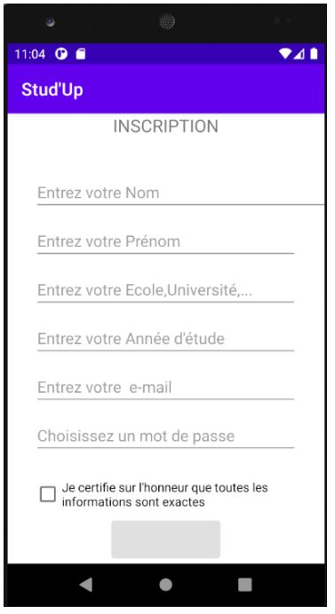
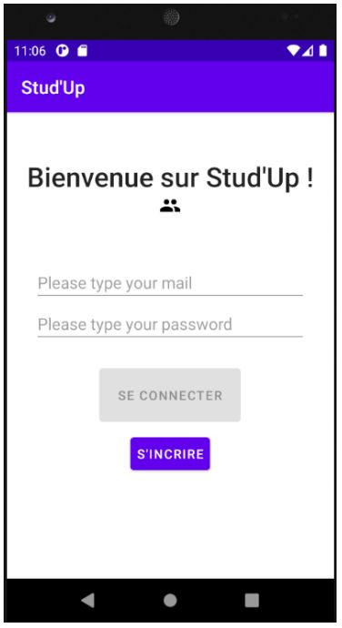
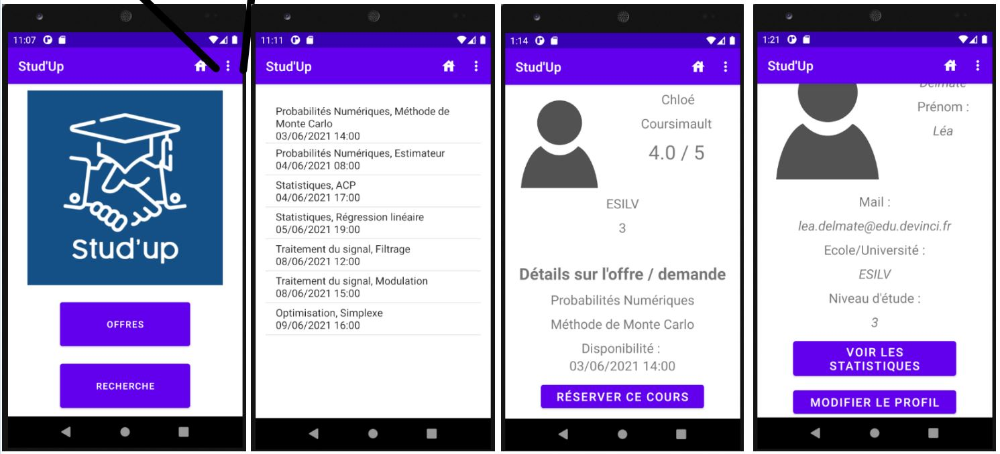
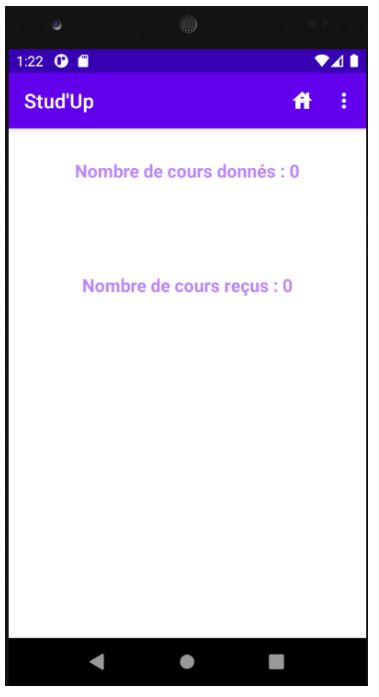
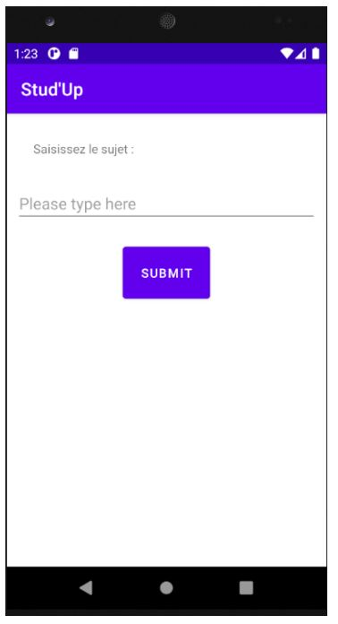
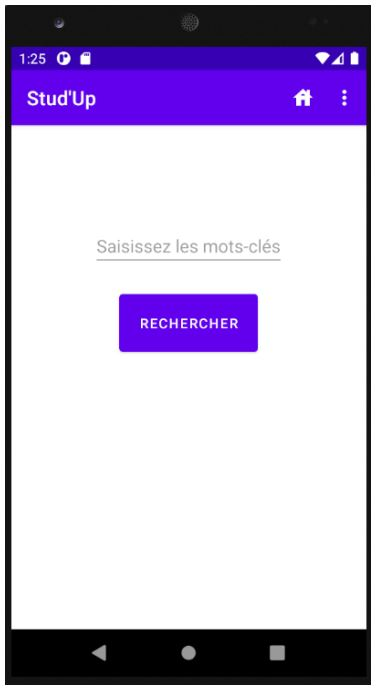

# PROJECT REPORT : STUD'UP

## Overview

We have developped a free application, Stud'Up, which can connect two students, from the same school/university or not, so that they can help each other. 

## VISUALS

  
  
  
  
  
  

## What do you need ?

This project uses :

||
|--|--|--|

## About the project

This project was realized with 4 other students at ESILV.
* Arthur Gay-Bellile
* Chloé Coursimault
* Octave Lanrans
* Maxime Geniess

## Helpful Links

* [APP_course1](https://openclassrooms.com/fr/courses/4517166-developpez-votre-premiere-application-android)
* [APP_course2](https://openclassrooms.com/fr/courses/2023346-creez-des-applications-pour-android/2023483-lunivers-android)
* [UML](https://online.visual-paradigm.com/drive/#diagramlist:proj=0&new=ClassDiagram)
- - -
